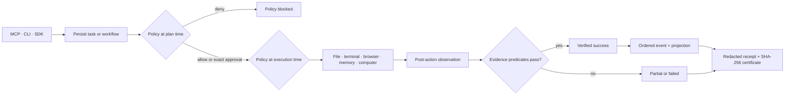

<div align="center">


# MELRA

**M**odular **E**xecution **L**ayer for **R**eliable **A**utonomy

### The open-source autonomy kernel

### The LLM reasons. The harness manages the loop. MELRA owns the effect lifecycle.

An agent-independent effect runtime for governed, durable, and verifiable
autonomous execution. MELRA begins where the tool call leaves the model loop.

**Your models can change. Your agents can change. Your execution foundation
shouldn't have to.**

<br />

<!-- Build & quality -->
<a href="https://github.com/XAGI-Lab/melra/actions/workflows/ci.yml"></a>
<a href="https://github.com/XAGI-Lab/melra/actions/workflows/codeql.yml"></a>
<a href="https://github.com/XAGI-Lab/melra/actions/workflows/audit.yml"></a>
<a href="https://github.com/XAGI-Lab/melra/actions/workflows/container.yml"></a>

<!-- Evidence -->


<br />

<!-- Stack -->


<br />

<!-- Platform & project -->


<br />

<a href="https://github.com/XAGI-Lab/melra/releases"></a>
<a href="LICENSE"></a>
<a href="CONTRIBUTING.md"></a>
<a href="https://github.com/XAGI-Lab/melra/discussions"></a>
<a href="CONTRIBUTING.md"></a>

<br /><br />


</div>

<br />

> [!WARNING]
> **MELRA is an alpha release.** Its local stdio runtime is tested end to
> end, but APIs may change before `1.0`. Use an isolated workspace, keep domain
> and command allowlists narrow, and review every consequential approval.

### Durable Core Alpha — `0.3.0-alpha.8`

| Shipped in this source release | Evidence |
|---|---|
| Restart-safe bounded workflows across nine node kinds | Real MCP process is stopped, replaced, and resumed in E2E |
| Encrypted exact task, workflow, and result payloads | AES-256-GCM storage plus plaintext-leak checks across SQLite/WAL and public projections |
| Eleven MCP tools for tasks and workflows | Container and stdio discovery checks require the exact tool set |
| Recovery without silent mutation replay | 8/8 deterministic recovery scenarios, zero duplicates, zero false success |
| Loopback HTTP transport, event stream, and read-only console | Same runtime as stdio, token on every route, `405` on any non-`GET` to the JSON API |

---

## Contents

| | | |
|---|---|---|
| [Why MELRA](#why-melra) | [Where it sits](#where-it-sits-) | [Quickstart](#quickstart-) |
| [Reference effect adapters](#reference-effect-adapters-) | [Where to use it](#where-you-can-use-melra-) | [MCP tool surface](#a-deliberately-small-mcp-surface-) |
| [How execution works](#how-execution-works-) | [Safe defaults](#safe-defaults-) | [Evidence](#evidence-not-leaderboard-theatre-) |
| [Reproduce the scores](#reproduce-the-scores-) | [SDKs](#sdks-and-implementation-languages-) | [Repository map](#repository-map-) |
| [Documentation](#documentation-) | [Contributing](#contributing-) | [Roadmap](ROADMAP.md) |

---

## Why MELRA

An LLM decides *what* to do. A harness runs the loop that gets it there.
Something still has to decide whether the resulting effect is allowed, run it
exactly once, prove it worked, and survive a crash in the middle. Today that
machinery is rebuilt inside every agent harness, in a way that dies with the
harness.

MELRA is that machinery, factored out and made agent-independent:

> **The LLM reasons. The harness manages the loop. MELRA owns the effect
> lifecycle.**

An **effect** is a named operation that changes or observes the world outside
the model — `file.write`, `terminal.execute`, `browser.click`,
`computer.keyboard`, `http.request`, `database.mutate`, `stripe.refund`,
`github.merge`. MELRA does exactly nine things to every one of them, and
nothing else:

| | MELRA does | Which answers |
|:--:|---|---|
| 1 | **Types** the effect against a strict, bounded schema | *Exactly what may change?* |
| 2 | **Classifies** it as read, mutation, or destructive | *How much does this matter?* |
| 3 | **Authorises** it against policy, re-checked at execution | *Is this allowed, still?* |
| 4 | **Gates** it on an exact human approval phrase | *Does a person decide?* |
| 5 | **Records** it durably before anything runs | *What was in flight?* |
| 6 | **Deduplicates** it by idempotency key | *Has this already happened?* |
| 7 | **Runs** it under a budget and a cancel signal | *When does it stop?* |
| 8 | **Verifies** it against declared evidence | *What proves it worked?* |
| 9 | **Receipts** it, redacted and hash-linked | *What can be audited later?* |

That list is the whole job. Everything upstream of it — what to attempt, in
what order, and why — stays with the model and the harness.

Which is why MELRA never receives a goal. "Fix the production server" requires
judgement about what is broken and what should change; that is reasoning, and
it belongs to the model. The model resolves it to a bounded operation, and
*that* is what arrives:

```json
{ "effect": "terminal.execute", "command": "systemctl",
  "args": ["restart", "api"], "environment": "production" }
```

An interface that accepted the sentence would have to interpret it, and a
kernel that interprets is a kernel whose guarantees depend on a model.

Most tool servers hand a model a tool and hope. A command runs, a click lands,
a file is written — and "it returned without an error" is treated as success.
MELRA separates **the action succeeded** from **the goal was achieved**.

<table>
<tr>
<th width="50%">🚫 Typical tool server</th>
<th width="50%">✅ MELRA</th>
</tr>
<tr>
<td>

- Tool call executes immediately
- Success = no exception thrown
- Policy, if any, checked once
- Mutations are indistinguishable from reads
- Output is trusted
- No durable record
- Rules live inside one agent

</td>
<td>

- **Plan** and **execute** are separate tool calls
- Success = declared evidence predicates passed
- Policy re-evaluated **at execution time**
- Mutations need evidence **and** an exact approval phrase
- Page content is explicitly marked untrusted
- Redacted receipt + SHA-256 execution certificate
- Rules outlive the agent that used them

</td>
</tr>
</table>

If a mutation succeeds but its required evidence is missing or false, the task
is `partial` — **never** `verified_success`.

**Agents should be replaceable. The infrastructure that owns consequences
should not be.** Swap the harness on Friday; the policies, approvals,
credentials, workflow history, idempotency records, and receipts are still
there on Monday.

Next to the two layers it is most often mistaken for:

|  | Agent harness | MCP server | MELRA |
|---|:---:|:---:|:---:|
| Model loop and reasoning | ✓ | ✗ | ✗ |
| Tools | ✓ | ✓ | via adapters |
| Execution | ✓ | ✓ | ✓ |
| Agent-independent policy | usually ✗ | possible | **core** |
| Durable effect state | sometimes | rarely | **core** |
| Idempotency across restarts | varies | rare | **core** |
| Crash recovery without replay | varies | rare | **core** |
| Independent verification | uncommon | possible | **core** |
| Evidence receipts | uncommon | possible | **core** |
| Works across agents | ✗ | ✓ | ✓ |
| Credential isolation | varies | varies | *target* |
| Hard capability boundary | varies | usually ✗ | *target* |

Plenty of MCP servers *can* do these things — this is not a claim that none of
them do. The difference is that in MELRA they are the execution contract rather
than a per-tool option. Items marked *target* are designed and on the
[roadmap](ROADMAP.md); they are **not shipped today**.

---

## Where it sits 🧭

Three layers, not two. The reasoning loop is the model and the harness
together; the effect lifecycle is below both of them.

```text
            ┌────────────────────────────────────────────┐
  reasoning │  LLM    Claude · GPT · Gemini · Llama      │
            │  reasons · decides what should happen      │
            └────────────────────────────────────────────┘
                           ▲ tool call   │ tools + context
                           │             ▼
            ┌────────────────────────────────────────────┐
   the loop │  AGENT HARNESS   OpenClaw · Hermes ·       │
            │  ATLAS · Claude Code · your own            │
            │  sessions · context · prompts · dispatch   │
            └────────────────────────────────────────────┘
                                   │  effect request
                                   ▼
            ╔════════════════════════════════════════════╗
    effects ║  MELRA — autonomy kernel                   ║
            ║                                            ║
            ║  identity · capability · policy ·          ║
            ║  authorization · credential broker ·       ║
            ║  durable execution · idempotency ·         ║
            ║  recovery · verification · evidence        ║
            ╚════════════════════════════════════════════╝
                                   │
                                   ▼
            ┌────────────────────────────────────────────┐
   adapters │  EFFECT ADAPTERS                           │
            │  files · terminal · browser · computer     │
            │  HTTP · database · cloud · SaaS            │
            └────────────────────────────────────────────┘
                                   ▼
             Linux · macOS · Windows · APIs · cloud
```

Many harnesses, one execution foundation:

```text
   OpenClaw ─┐
   Hermes ───┤
   ATLAS ────┼──→  MELRA  ──→  your systems
   Custom ───┘
```

Who owns what, and this does not move:

| Layer | Owns |
|---|---|
| **LLM** | Reasoning · tool selection · planning |
| **Harness** | Conversation · prompt construction · model routing · semantic memory · agent personality · subagent reasoning |
| **MELRA** | Effect authorization · effect execution · durable effect state · recovery · verification · evidence · credentials and capabilities |

MCP is *one* way to reach the kernel, not what the kernel is. MCP, CLI, SDK,
and loopback HTTP all enter the same runtime, take the same policy decision,
and write the same durable record.

---

## Reference effect adapters 🔌

The kernel is the contract; these are its shipped implementations of it. Every
one passes through the same policy, approval, budget, verification, receipt,
and certificate pipeline — an adapter that skipped it would not be an adapter.

| | Adapter | What is implemented |
|:--:|---|---|
| 🗂️ | **Files** | Root-confined read, hash, atomic write, move, mkdir, and delete with symlink-escape defenses |
| 💻 | **Terminal** | Shell-free foreground and supervised background processes with allowlists, traits, timeouts, interactive input, cancellation, and redaction |
| 🌐 | **Browser** | Isolated Playwright sessions, semantic DOM targets, bounded artifacts, network policy, popup policy, opt-in profiles, and condition-based post-action settling |
| 🖥️ | **Computer** | Capability discovery plus governed screenshot, pointer, keyboard, and scroll adapters on macOS and supported Linux/X11 setups |

The diagram above also shows HTTP, database, cloud, and SaaS adapters. Those are
designed and on the [roadmap](ROADMAP.md) — **not shipped today**. A serious
amount of autonomous work happens through APIs rather than mouse clicks, and an
API effect needs the same nine guarantees as a file write.

**Operational memory** is a kernel service rather than an adapter: what MELRA
knows about its own effects — which operation changed what, which attempt was
already committed, what a previous run observed. Scoped SQLite storage with
hybrid lexical ranking, episode context, confidence, freshness, expiry,
supersession, provenance, and redaction. Semantic memory about the *user* —
preferences, project context, conversation history — belongs to the harness
above, not here.


---

## Where you can use MELRA 🛠️

MELRA works with any MCP client that can launch a local stdio server.

<div align="center">

| Client | Setup | Status |
|---|:--:|:--:|
| **Claude Desktop** | [docs](docs/INSTALLATION.md) |  |
| **Cursor** | [docs](docs/INSTALLATION.md) |  |
| **VS Code** | [docs](docs/INSTALLATION.md) |  |
| **Any stdio MCP client** | [docs](docs/INSTALLATION.md) |  |

</div>

> [!NOTE]
> A named client is marked **verified** only after the *released artifact* —
> not a source checkout — passes discovery, planning, approval, execution,
> cancellation, and receipt retrieval in that client. Current per-client status
> is tracked in [COMPATIBILITY.md](docs/COMPATIBILITY.md).

### What people actually do with it

| | Use case | Small example | Verified outcome |
|:--:|---|---|---|
| 👩‍💻 | **Coding clients** | Inspect a repository, run `pnpm check`, write a bounded file change | Exit code, file existence, content, or hash |
| 🌐 | **Browser workflows** | Open an allowlisted page, inspect it, fill a form after approval | Final URL and page content |
| 💻 | **Terminal automation** | Run a shell-free build or supervise a background process | Exit code and bounded stdout |
| 🖥️ | **Computer use** | Discover local support, capture a screenshot, approve pointer or keyboard input | Adapter result plus declared evidence |
| 🧠 | **Project memory** | Store a test command, architectural decision, or operating procedure | Scoped record with provenance and redaction |
| 🔁 | **Durable workflows** | Inspect, write an approved artifact, restart between nodes, then checkpoint | Ordered events, independent file evidence, receipt, and certificate |

<details>
<summary><b>Show a governed terminal operation</b></summary>

<br />

A coding client submits one bounded operation with the evidence it expects:

```json
{
  "goal": "Run the repository checks",
  "operation": {
    "kind": "terminal",
    "action": "run",
    "command": "pnpm",
    "args": ["check"]
  },
  "requiredEvidence": [
    { "type": "exit_code", "value": 0 }
  ]
}
```

The task reaches `verified_success` only if the process exits `0`. A process
that runs and exits `1` is a completed action with failed evidence — reported
as `partial`.

</details>

<details>
<summary><b>Show scoped project memory</b></summary>

<br />

```bash
pnpm melra run --request examples/07-project-decision-memory/task.json
```

Records are scoped, provenance-tagged, and pass through secret redaction before
they are persisted.

</details>

See all [runnable examples](examples/README.md) — browser inspection, verified
file writes, terminal checks, scoped memory, and computer capability discovery.

---

## Quickstart 🚀

**npm (fastest — needs Node 22+):**

```bash
npx @melra/cli@alpha setup
```

One command: writes a safe local policy, prints a ready-to-paste MCP client
config, and runs every readiness check. Add `--client claude|cursor|vscode|codex`
to label the config for a specific client. Use `doctor` alone to check readiness
without writing anything.

**Container (no Node install needed):**

```bash
docker run --rm ghcr.io/xagi-lab/melra:alpha doctor
```

**Prebuilt release:** Download from the [releases page](https://github.com/XAGI-Lab/melra/releases), extract, and run:

```bash
tar -xzf melra-node-<version>.tar.gz -C melra
node melra/dist/bin.js doctor
```

**From source** (for development):

```bash
git clone https://github.com/XAGI-Lab/melra.git
cd melra
corepack enable
pnpm install --frozen-lockfile
pnpm build
pnpm melra setup
```

<table>
<tr><th>Goal</th><th>Command</th></tr>
<tr><td>Set up policy, client config, and readiness at once</td><td><code>melra setup</code></td></tr>
<tr><td>Start the stdio server</td><td><code>melra serve</code></td></tr>
<tr><td>Start the HTTP server and console</td><td><code>melra serve --http</code></td></tr>
<tr><td>Run a read-only system task</td><td><code>melra run --request examples/01-system-info/task.json</code></td></tr>
<tr><td>Run a verified mutation</td><td><code>melra run --request examples/02-verified-file-write/task.json</code></td></tr>
<tr><td>Inspect a stored receipt</td><td><code>melra inspect &lt;task-id&gt;</code></td></tr>
<tr><td>Advance a durable workflow</td><td><code>melra workflow advance &lt;workflow-id&gt;</code></td></tr>
<tr><td>Test a policy file</td><td><code>melra policy test</code></td></tr>
</table>

Mutations pause for an exact, expiring, task-scoped approval phrase. See
[installation and client setup](docs/INSTALLATION.md) for Claude Desktop,
Cursor, VS Code, generic clients, Python, and Docker.

MELRA creates `<MELRA_HOME>/payload.key` with private permissions on first
start. Back it up together with the SQLite files: losing or changing the key
makes persisted executable payloads unreadable. Never commit the key or place
it directly in a shared client configuration.

> [!CAUTION]
> The **unscoped** npm package `melra` and the PyPI package `melra` are
> **unrelated third-party projects**. This project publishes only under the
> `@melra/` npm scope — `@melra/cli` is the CLI. Install from that scope, from
> this repository, or from official
> [XAGI-Lab releases](https://github.com/XAGI-Lab/melra/releases).

---

## Restart-safe first workflow 🔁

The committed example performs a read, pauses for an approved file write, and
finishes at a durable checkpoint. Each CLI invocation is a new process, so this
sequence exercises restart persistence without keeping a daemon alive:

```bash
node apps/cli/dist/bin.js workflow plan \
  --definition examples/workflows/restart-safe.json
# save the returned workflow id

node apps/cli/dist/bin.js workflow advance <workflow-id>
node apps/cli/dist/bin.js workflow advance <workflow-id>
# the second command exits 3 and returns the write approval challenge

node apps/cli/dist/bin.js workflow advance <workflow-id> \
  --approval '<approval-id>:<exact phrase>'
node apps/cli/dist/bin.js workflow advance <workflow-id>
```

Shortened output captured from the `0.3.0-alpha.0` release candidate:

```text
planned            stateVersion=2
running            stateVersion=4   inspect=verified_complete
awaiting_approval  stateVersion=7   phrase="APPROVE <digest prefix>"
running            stateVersion=10  write=verified_complete
verified_complete  stateVersion=14  checkpoint=verified_complete
```

The final file is read independently in the real-process E2E test. Closing the
process after any displayed boundary and running the next command against the
same `MELRA_HOME` resumes the persisted workflow.

---

## A deliberately small MCP surface ✨

Eleven tools in front of the reference effect adapters and one durable workflow
controller. The CLI, both SDKs, and loopback HTTP reach the same eleven
operations — this list is the kernel contract, not an MCP-specific API:

| MCP tool | Purpose |
|---|---|
| `melra_capabilities` | Discover operations, platform support, limits, and policy posture |
| `melra_plan` | Validate, persist, and policy-check one bounded operation |
| `melra_execute` | Execute an approved plan and verify the declared outcome |
| `melra_task_status` | Read durable task state |
| `melra_task_cancel` | Cooperatively cancel pending or running work |
| `melra_receipt` | Retrieve redacted evidence and the execution certificate |
| `melra_workflow_plan` | Validate, preflight, encrypt, and persist a bounded workflow |
| `melra_workflow_advance` | Execute one ready scheduling wave |
| `melra_workflow_status` | Read the durable workflow projection |
| `melra_workflow_cancel` | Cooperatively cancel nonterminal workflow work |
| `melra_workflow_control` | Pause, resume, or suspend a run without losing its place |

Workflow definitions compose operation, approval, condition, parallel,
bounded-loop, checkpoint, compensation, human-input, and delegation nodes while
every effect still travels through the task policy and evidence pipeline.

If you would rather your model saw the tool names it already knows, set
`MELRA_HARNESS_TOOLS=1` and thirteen more appear alongside these — `read_file`,
`write_file`, `run_command`, `browser_click`, `approve`, and the rest. They are
not a second path: each one builds an ordinary task and runs the same pipeline,
and a mutation still stops on its approval phrase. See
[INSTALLATION.md](docs/INSTALLATION.md#ordinary-tool-names).

---

## How execution works ⚙️



Task lifecycle:

```text
planned → awaiting_approval → running → verifying
                                     ↘ verified_success
                                     ↘ partial | failed | cancelled | budget_exhausted
```

Policy is evaluated **twice** — once when the plan is persisted and again at
execution — so a stale plan can never ride a since-tightened policy.

> [!IMPORTANT]
> **Current alpha boundary:** exact task and workflow payloads survive restart
> in AES-256-GCM envelopes. Interrupted reads may retry; interrupted mutations
> are never silently repeated and require independent filesystem
> reconciliation or enter `recovery_required`. Evidence predicates remain
> caller-authored: filesystem predicates independently re-read state, while
> result, terminal, URL, and page predicates evaluate adapter observations.

---

## Evidence, not leaderboard theatre 📊

The numbers below come from committed scripts and JSON artifacts measured on an
Apple Silicon Mac. They are **component measurements**, not a claim that MELRA
MCP is universally "the best" or that unlike benchmarks are comparable.

| | Capability | Current public result | What it means |
|:--:|---|---:|---|
| 🧠 | LoCoMo retrieval | **0.7597** mean evidence coverage@20 | 1,982 evidence-bearing questions; +20.75% relative over the previous public ranker; zero model, embedding, or network calls |
| 🧠 | Synthetic recall | **100/100** Recall@1 | Deterministic planted-fact regression over 1,000 records |
| 🌐 | Static-page settle | **183.7 ms** p50 vs 301.3 ms | 39% less waiting with identical 10/10 correct reads |
| 🌐 | Slow-render settle | **10/10** vs 0/10 correct | Condition-based waiting observes the final DOM; fixed 300 ms reads too early |
| 💻 | Terminal | **30/30** verified executions | Shell-free process launch; 48.1 ms p50 on the measured machine |
| 🖥️ | Computer control plane | **30/30** capability probes | 0.032 ms p50 adapter discovery; this is *not* a desktop task-success score |
| ✅ | Safety/execution evals | **36/36** passing | Deterministic policy, capability-grant, traversal, terminal, memory, computer, cancellation, and verification scenarios |
| 🔁 | Durable Core eval | **8/8** valid scenarios | 100% expected recovery, 0 duplicate execution, 0 false success, 100% event consistency |

Read the [research index](docs/research/README.md), the
[benchmark methodology](docs/research/METHODOLOGY.md), and the raw
[microbenchmark](docs/research/results/core-microbenchmarks.json) and
[LoCoMo](docs/research/results/locomo-retrieval.json) artifacts.

### Browser-agent evaluation — harness registered, score not yet claimed

The repository contains a pre-registered browser-agent evaluation harness:

| Track | Status |
|---|---|
| MiniWoB-125 development suite (`browsergym-miniwob==0.14.3`) |  |
| WebArena-Verified Hard-30 registered subset (`webarena-verified==1.2.3`) |  |
| Published representative score |  |

Task IDs, upstream revisions, and dataset hashes are frozen in
[`benchmarks/browser-agent/manifests/`](benchmarks/browser-agent/manifests) and
enforced by `pnpm benchmark:browser:verify-upstream`. A score will be published
only after a full fixed-denominator run completes without infrastructure-invalid
pairs *and* its sanitized artifact passes the publication gate.

> [!IMPORTANT]
> MELRA has **not** run an official OSWorld, OSWorld-MCP, WebArena, or
> LongMemEval end-to-end submission. Those scores remain unclaimed until the
> exact public harness, environment, model policy, and evaluator are released
> with the result.

---

## Safe defaults 🔒

| | Default |
|:--:|---|
| 🏠 | Local-only transports — stdio, or loopback HTTP behind a token; no account or hosted service required |
| 📴 | Telemetry is **off** |
| 🚫 | Shell interpreters, privilege escalation, and arbitrary desktop key names are denied |
| 📁 | Paths and terminal working directories stay inside the configured root |
| 🌐 | Private, link-local, loopback, and cloud-metadata destinations are blocked by the browser runtime itself, before any allowlist is consulted; `allowedDomains` narrows which *public* sites are reachable |
| ⚠️ | Browser output is marked untrusted; page content never changes policy |
| ✍️ | Mutations require **both** declared evidence and an exact task-scoped approval |
| 🔑 | Secret patterns are redacted before terminal output, memory, tasks, or receipts are persisted |
| 🎛️ | Computer actions use bounded typed fields and platform adapters — not a user-supplied shell command |

See the [threat model](docs/THREAT_MODEL.md) and
[security policy](SECURITY.md) for residual risks.

Every row above can be turned off at once with `melra serve --unhinged` (or
`MELRA_UNHINGED=1`): no policy, no approvals, no evidence requirement, no
workspace confinement, no destination checks. The agent gets exactly the reach
your OS user has. The mode announces itself on stderr, in `melra doctor`, and in
`melra_capabilities`, and receipts still record what ran. See
[unhinged mode](docs/INSTALLATION.md#unhinged-mode) for what stays on and why.

---

## Reproduce the scores 🧪

```bash
# full validation gate
pnpm check
pnpm evals
pnpm e2e
pnpm pack:check
pnpm security:audit
pnpm --filter @melra/evals evaluate:durable-core -- --publishable

# local memory, browser, terminal, and computer microbenchmarks
pnpm benchmark:core

# hardened local container and real MCP smoke
docker build -t melra:local .
docker run --rm melra:local doctor
pnpm docker:smoke
```

<details>
<summary><b>LoCoMo memory retrieval</b> — dataset intentionally not vendored (CC BY-NC 4.0)</summary>

<br />

```bash
git clone https://github.com/snap-research/locomo.git /tmp/locomo
pnpm benchmark:locomo -- \
  --dataset /tmp/locomo/data/locomo10.json \
  --output docs/research/results/locomo-retrieval.json
```

</details>

<details>
<summary><b>Browser-agent harness</b> — contract checks and the MiniWoB development suite</summary>

<br />

Contract and registered-selection checks run with no model and no network
environment:

```bash
pnpm benchmark:browser:check
pnpm benchmark:browser:verify-upstream
```

The MiniWoB development suite additionally needs the pinned MiniWoB++ assets, a
built CLI (`pnpm build`), and an agent configuration whose `api_key_env` names a
variable present in the environment:

```bash
uv run --project benchmarks/browser-agent --extra miniwob \
  melra-browser-bench run-miniwob \
  --manifest benchmarks/browser-agent/manifests/miniwob-125-v1.json \
  --run-dir benchmarks/browser-agent/runs/miniwob-candidate \
  --workspace benchmarks/browser-agent/runs/workspaces \
  --base-url "$MINIWOB_BASE_URL" \
  --browser-executable "$MELRA_BROWSER" \
  --implementation-commit "$(git rev-parse HEAD)" \
  --agent-config benchmarks/browser-agent/runs/config/agent.json
```

Run outputs — HAR, screenshots, video, and transcripts — are Git-ignored and
must never be committed.

</details>

Benchmark artifacts include dataset hashes, environment details, sample counts,
latency percentiles, and explicit claim boundaries.

---

## SDKs and implementation languages 🧩

| SDK | Package | Language |
|---|---|:--:|
| TypeScript client | [`@melra/sdk`](packages/sdk-ts) |  |
| Python client | [`melra`](sdk-py) |  |
| JSON contracts | [`@melra/protocol`](packages/protocol) · [`@melra/receipt-schema`](packages/receipt-schema) |  |

MELRA is capability-driven, not language-restricted. Rust, Go, Python,
TypeScript, Swift, C#, or another language can be used when measurement shows a
real improvement in isolation, portability, performance, reliability, or
platform integration without fragmenting the public contracts.

---

## Repository map 🗂️

```text
apps/cli/                   CLI and stdio entrypoint

kernel services
packages/protocol/          strict task, workflow, event, and operation schemas
packages/runtime-core/      task/workflow lifecycle, events, recovery
packages/policy-core/       local policy and scoped approvals
packages/storage-sqlite/    transactional tasks, workflows, events, evidence
packages/verifier-core/     deterministic evidence predicates
packages/receipt-schema/    receipts and execution certificates
packages/memory/            operational memory: scoped retrieval and lifecycle
packages/server/            runtime composition, MCP and loopback HTTP

reference effect adapters
packages/file-runtime/      confined filesystem operations
packages/terminal-runtime/  shell-free process supervision
packages/browser-runtime/   isolated browser automation and stable-DOM wait
packages/computer-runtime/  governed local computer-use adapters

clients and evidence
packages/sdk-ts/            TypeScript client SDK
sdk-py/                     Python client SDK
benchmarks/browser-agent/   pre-registered browser-agent evaluation harness
evals/                      safety and durable crash-recovery evaluations
scripts/                    benchmark and release checks
docs/research/              methods, findings, and raw results
examples/                   runnable task examples
```

---

## Documentation 📚

| | | |
|---|---|---|
| 📦 [Installation & client setup](docs/INSTALLATION.md) | 🧭 [Capabilities & limits](docs/CAPABILITIES.md) | 🏛️ [Architecture](docs/ARCHITECTURE.md) |
| 🔬 [Research & benchmarks](docs/research/README.md) | 🔗 [Compatibility policy](docs/COMPATIBILITY.md) | ✅ [Validation evidence](docs/VALIDATION.md) |
| 🛡️ [Threat model](docs/THREAT_MODEL.md) | 🗺️ [Roadmap](ROADMAP.md) | 📝 [Changelog](CHANGELOG.md) |

---

## Contributing 🤝

Code, adapters, benchmark harnesses, verifier predicates, documentation, and
threat analysis are all welcome.

1. Read [CONTRIBUTING.md](CONTRIBUTING.md) and the
   [Code of Conduct](CODE_OF_CONDUCT.md).
2. Sign your commits under the DCO (`git commit -s`).
3. Run `pnpm check` before opening a pull request.
4. Report vulnerabilities through
   [GitHub private vulnerability reporting](https://github.com/XAGI-Lab/melra/security/advisories/new)
   — never in a public issue.

---

## License 📄

Software and documentation are licensed under the
[Apache License 2.0](LICENSE). The official logo and hero artwork are licensed
under [CC BY-ND 4.0](LICENSES/CC-BY-ND-4.0.txt).
Third-party benchmark datasets retain their own licenses and are not included
in this repository.

<div align="center">
<br />

**Built in the open by [XAGI Labs](https://github.com/XAGI-Lab).**

<sub>MELRA brand assets © XAGI Labs Private Limited, licensed CC BY-ND 4.0.</sub>

</div>
