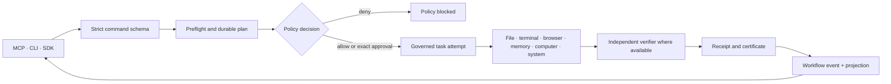

# Architecture

MELRA is a local-first autonomy kernel: the layer an agent asks to change the
world through, rather than a layer that decides what to change. MCP, CLI, SDK,
and loopback HTTP callers use the same task and workflow services; no interface
bypasses schema validation, policy, approval, budgets, verification, or durable
evidence.

## Responsibility boundary

There are three layers, and the dividing line is *reasoning* against *effects*.

| Layer | Owns |
|---|---|
| **LLM** | Reasoning, tool selection, planning |
| **Agent harness** | Conversation, prompt construction, model routing, semantic memory, agent personality, subagent reasoning |
| **MELRA** | Effect authorization, effect execution, durable effect state, recovery, verification, evidence, credentials and capabilities |

MELRA begins where the tool call leaves the model loop. It deliberately has no
model client, planner, or reasoning loop. Adding one would put it in competition
with the harnesses it is supposed to serve, and would make the guarantees below
depend on a model's judgement.

The consequence for code: nothing in `packages/` may call an LLM, and no
decision in the execution path may depend on model output. Evidence predicates
are deterministic by construction for exactly this reason — see
[verification levels](#verification-strength).

A corollary that decides most scope questions: MELRA never receives a goal.
"Fix the production server" requires judgement about what is broken; the model
resolves it to a bounded operation — effect `terminal.execute`, command
`systemctl restart api`, environment `production` — and that is what arrives at
the kernel.

## Effect lifecycle

Every effect, from any interface, walks the same stages. Stages in **bold** can
refuse; the rest can only record.

```text
REQUEST      a caller submits a strict, bounded operation schema
NORMALIZE    schema validation, path resolution, classification
IDENTITY     which principal asked, on whose behalf
CAPABILITY   what this principal may reach at all
PREFLIGHT    adapter capability discovery and cheap feasibility checks
RECORD       durable TaskRecord written before anything runs
POLICY       allow · deny · confirm, on effect and risk
APPROVAL     exact task-scoped phrase bound to the action digest
CREDENTIALS  the kernel acquires what the effect needs; the caller never sees it
IDEMPOTENCY  logical attempt key; a committed attempt is not re-run
EXECUTION    the adapter runs under an AbortSignal and a budget
OBSERVATION  raw adapter result, redacted before persistence
VERIFICATION independent predicates decide success, not the adapter
COMMIT       terminal status, events, projection, certificate
RECEIPT      redacted, hash-linked evidence retained locally
RESULT       returned to the caller
```

`melra_plan` stops after `APPROVAL` and returns the challenge.
`melra_execute` **re-runs** `CAPABILITY` and `POLICY` before `EXECUTION`, so a
plan cannot ride a policy that has since been tightened.

`IDENTITY` and `CAPABILITY` are real stages but weak ones: the principal is a
claim the caller makes rather than something MELRA authenticates, and grants are
checked only where an operator has issued them. `CREDENTIALS` is still a no-op —
adapters use the ambient process environment, so an agent that can reach the
kernel can reach whatever the kernel's process can. Closing those two is
[P2](../ROADMAP.md#p2--hard-capability-boundary) and
[P4](../ROADMAP.md#p4--credentials-and-api-effects) work, listed here because
the lifecycle is the contract even where the implementation is still one step.

## Effect contract

The stages above each read a field of one object. `EffectContract` is what those
fields are called together:

```ts
interface EffectContract {
  contractVersion: string;
  taskId: string;
  identity: Identity;          // who asked, on whose behalf
  capability: string;          // file.write, terminal.run, browser.click
  operation: Operation;        // the strict, bounded schema
  effect: Effect;              // read · mutate · destructive
  risk: Risk;
  target: string;
  traits: CapabilityTrait[];   // package-install, network
  forbiddenEffects: Effect[];  // limits the caller placed on itself
  postconditions: EvidencePredicate[];
  budget: TaskBudget;
  idempotencyKey?: string;
  policy: PolicyDecision;
  authorization?: ApprovalChallenge;
  metadata: { goal: string };
}
```

It is **derived from a persisted task, never supplied**. `melra_plan` returns it
alongside the record it was derived from, so what a caller reads before echoing
an approval phrase is the same object the execution path will load. A second
input path that could describe an effect differently from the one about to run
would be a way around the approval, not a convenience.

## Identity and capability grants

`identity` is optional on a request: `{ principal, onBehalfOf }`, where
`principal` is the immediate caller and `onBehalfOf` is the chain behind it,
outermost first — organization → human → harness → parent agent. A request that
declares none is the local principal, `agent:local`. Every receipt records the
chain as one line (`organization:acme/human:dheeraj/agent:claude-code`), so a
receipt answers *who authorised this*, not only *what ran*.

MELRA authenticates exactly one link. Over loopback HTTP a client that completed
the OAuth flow ([installation](INSTALLATION.md#clients-that-let-themselves-in))
is recorded as `harness:<name>#<id prefix>` at the outermost end of the chain,
ahead of whatever the request declared — because anything a client names, a
session or a subagent, is inside it and never above it. Every other link is a
claim the layer above makes, worth exactly what that layer's own boundary is
worth, which over stdio is nothing. Enforced mode
([P2](../ROADMAP.md#p2--hard-capability-boundary)) is where the rest of the
chain becomes fact rather than claim.

`policy.capabilities` turns that identity into bounded authority. Each grant
names a capability pattern, the effects allowed under it, a target pattern, the
holder, and optionally `validUntil` and `policyVersion`. An empty list — the
default — means no narrowing. A non-empty list is a closed world, checked before
any allowlist: authority comes first, because the allowlists describe what a
grant holder may do, not whether they hold one. A grant is matched against the
immediate principal, which is a link the caller declares, so it narrows what a
cooperating caller can reach rather than standing between it and the effect.

## Execution boundaries



A command requests a transition. Accepted workflow transitions append events
and update the current projection in one `BEGIN IMMEDIATE` SQLite transaction.
Events are the ordered facts; the projection serves status reads; snapshots
accelerate replay at checkpoints but do not replace event history.

Planning never executes an adapter. Task execution re-evaluates policy and
revalidates an approval against the current action digest immediately before
the effect.

Unhinged mode removes the `Policy` diamond and the runtimes' confinement, leaving
the rest of the chain intact: tasks are still planned, executed, verified against
whatever evidence the caller declared, and receipted. It is implemented by
short-circuiting `evaluatePolicy` to `allow` and by rooting the file runtime,
terminal runtime, and verifier at the filesystem root instead of the workspace —
not by adding bypass branches to the confinement code, which keeps exactly one
behaviour. See [unhinged mode](INSTALLATION.md#unhinged-mode).

## Durable storage

MELRA uses `<MELRA_HOME>/melra.sqlite` in WAL mode. Schema migration version
`1` adds the durable workflow and payload tables.

| Table | Authority |
|---|---|
| `schema_migrations` | Applied durable-schema versions |
| `tasks` | Redacted task projections |
| `task_payloads` | Encrypted exact task requests and optional results |
| `receipts` | Redacted action evidence |
| `certificates` | One terminal execution certificate per task |
| `memories` | Scoped, redacted local memory |
| `workflow_definitions` | Redacted immutable workflow definitions |
| `workflow_payloads` | Encrypted exact workflow definitions by version |
| `workflow_runs` | Current workflow projections and state versions |
| `workflow_events` | Append-only aggregate events with unique sequence |
| `workflow_snapshots` | Validated checkpoint projections |
| `idempotency_commits` | Unique committed logical task attempts |

Workflow creation persists the redacted definition, encrypted definition,
initial projection, and first two events atomically. Later transitions use
compare-and-swap on `state_version`; stale writers fail with
`workflow_state_conflict`.

## Encrypted executable payloads

Exact task requests, task results, and workflow definitions are canonicalized
and sealed with AES-256-GCM. A random 96-bit IV is used for every envelope.
Authenticated additional data binds ciphertext to its task or workflow
identity, version, and purpose, preventing record substitution.

The 256-bit key comes from one of two sources:

- `MELRA_PAYLOAD_KEY`, encoded as canonical base64url; or
- `<MELRA_HOME>/payload.key`, created atomically with mode `0600` inside a
  mode-`0700` data directory.

On Unix, an existing key with group/other permissions is rejected. Symlinks
and non-regular key files are rejected. Losing or changing the key makes
existing payloads unreadable. MELRA does not escrow or recover keys.

Status, events, logs, receipts, and certificates contain redacted projections,
not executable plaintext. `MELRA_HOME` still contains sensitive encrypted
material and must not be committed or publicly synchronized.

## Workflow model

A definition is an immutable, versioned DAG with at most 500 nodes. Node IDs
are unique; dependencies must exist; self-dependencies and cycles are rejected
before persistence. Every nested task is capability- and policy-preflighted
before the workflow is accepted.

| Node | Implemented semantics and bounds |
|---|---|
| `operation` | One governed task request |
| `approval` | Plans the target operation and pauses for its exact scoped challenge |
| `condition` | Re-verifies a persisted source result, then executes at most 50 requests from the selected branch |
| `parallel` | Executes 2–20 independent branches concurrently, each with 1–50 sequential requests |
| `bounded_loop` | Executes 1–50 body requests for at most 100 iterations and may stop on a persisted predicate |
| `checkpoint` | Emits `workflow.checkpoint_saved` and stores a validated snapshot |
| `compensation` | Runs a governed compensating request after its verified target is followed by failure |
| `human_input` | Blocks in `awaiting_input` until `advance` supplies a value within `maxLength` and, where declared, within `choices` |
| `delegation` | Blocks in `awaiting_input` until an outside worker reports back; the node's own `requiredEvidence` decides the outcome |

The total definition limit is 500 nodes; each node may declare at most 100
dependencies. A task budget allows at most 100 steps, 900 seconds, and 10 read
retries. Mutations are never automatically retried.

A delegate reporting "done" is not evidence. A `delegation` node that declared
predicates and whose predicates fail is `failed`, exactly as an `operation`
node would be.

## Workflow state and events

Workflow statuses are:

```text
draft → planned → running → verified_complete
                  ↘ awaiting_approval
                  ↘ awaiting_input
                  ↘ paused        (operator, resumable)
                  ↘ suspended     (operator, resumable)
                  ↘ recovery_required
                  ↘ failed
                  ↘ cancelled
```

`paused` and `suspended` are entered by the operator commands `workflow pause`
and `workflow suspend`, and left by `workflow resume`; an `advance` against
either is refused rather than queued. The public schema also reserves
`partially_complete`, which no command enters today.

Implemented event types are:

- `workflow.created`;
- `workflow.status_changed`;
- `workflow.node_changed`;
- `workflow.checkpoint_saved`;
- `workflow.recovered`;
- `workflow.recovery_required`;
- `workflow.paused`;
- `workflow.suspended`;
- `workflow.resumed`;
- `workflow.cancelled`.

Sequences start at one and increase without gaps per workflow. Event replay
rejects duplicate, missing, reordered, or corrupt history. A corrupt snapshot
may be ignored only when full event replay succeeds.

## Restart, uncertainty, and concurrency

At startup, task recovery runs before workflow recovery and before any public
interface is served.

- Planned and approval-waiting payloads remain executable after restart.
- Interrupted reads return to `planned` and may retry within their original
  budget and idempotency identity.
- A mutation in `verifying` may become `verified_success` only when all
  required predicates are independent filesystem observations
  (`file_exists`, `file_absent`, or `file_hash`).
- Other interrupted mutations enter `recovery_required`; MELRA does not repeat
  them automatically.
- A verified task committed before its workflow projection is repaired from
  persisted task evidence and recorded as `workflow.recovered`.
- Idempotency keys bind workflow, node, iteration, branch, and canonical
  request. SQLite rejects a second committed attempt.
- Competing advances for one workflow are serialized inside a server process.
  Concurrent independent branches remain parallel.

Multiple MELRA server processes may share one `MELRA_HOME`. Advancing a workflow
takes an expiring SQLite lease before any adapter runs, so a second process is
refused with `workflow_lease_held` rather than starting duplicate side effects.

## Public interfaces

MCP is one way into the kernel, not the definition of it. Every interface
below enters the same runtime, takes the same policy decision, and writes the
same durable record; none of them is a shortcut past a stage of the lifecycle.

| Interface | Transport | Intended caller |
|---|---|---|
| MCP | stdio | An MCP client spawning the server as a subprocess |
| MCP | Streamable HTTP on loopback | A client that cannot spawn processes |
| CLI | argv | Humans, scripts, CI |
| TypeScript SDK | stdio subprocess | Node applications and custom harnesses |
| Python SDK | stdio subprocess | Python applications and custom harnesses |
| JSON API | loopback HTTP, read-only | Consoles and dashboards |

The MCP surface is exactly eleven tools:

| Task tools | Workflow tools |
|---|---|
| `melra_capabilities` | `melra_workflow_plan` |
| `melra_plan` | `melra_workflow_advance` |
| `melra_execute` | `melra_workflow_status` |
| `melra_task_status` | `melra_workflow_cancel` |
| `melra_task_cancel` | `melra_workflow_control` |
| `melra_receipt` |  |

The CLI exposes `workflow plan`, `workflow advance`, `workflow inspect`,
`workflow cancel`, and the operator halts `workflow pause`, `workflow resume`,
and `workflow suspend`. The TypeScript and Python SDKs call the same workflow
tools and do not implement a second execution engine.

## Packages

Kernel services own the guarantees. Reference effect adapters are replaceable
implementations that must pass through those services to reach anything.

| Kernel service | Responsibility |
|---|---|
| `@melra/protocol` | Strict task, workflow, event, approval, and MCP contracts |
| `@melra/runtime-core` | Task execution, workflow transitions, recovery, and replay |
| `@melra/policy-core` | Allow/deny/confirm policy and approval validation |
| `@melra/storage-sqlite` | Transactional local authority |
| `@melra/verifier-core` | Deterministic evidence evaluation |
| `@melra/receipt-schema` | Canonical receipts, certificates, hashes, and redaction |
| `@melra/memory` | Operational memory: scoped local retrieval, lifecycle, redaction |
| `@melra/server` | Runtime composition and the MCP/HTTP transports |

| Reference effect adapter | Effects it can perform |
|---|---|
| `@melra/file-runtime` | Root-confined filesystem operations |
| `@melra/terminal-runtime` | Shell-free process and background-job control |
| `@melra/browser-runtime` | Isolated Playwright browser execution |
| `@melra/computer-runtime` | Typed local computer-use adapters |

`@melra/sdk` is a client of the kernel rather than a part of it.

`@melra/memory` is operational memory — what MELRA knows about its own
effects. Semantic memory about the *user* (preferences, project context,
conversation) belongs to the agent above and is deliberately out of scope.

## Verification strength

Success is decided by evidence, never by the adapter's own report. How much a
piece of evidence is worth depends on where it came from, and MELRA states that
rather than flattening it into a boolean:

| Level | Name | What it is | Example | Shipped |
|:--:|---|---|---|:--:|
| 0 | **Execution** | The adapter's own report | exit code `0`, HTTP 200, no exception | ✓ |
| 1 | **State** | MELRA re-reads the target itself | `file_exists`, `file_hash` re-reading the workspace | ✓ |
| 2 | **Independent** | A different channel to the same fact | execute via `POST /refund`, verify via `GET /refund/:id` | roadmap |
| 3 | **Semantic** | A judgement about meaning | "the summary is accurate" | roadmap, and **probabilistic** |

Execution evidence is the weakest: it says the call returned, not that the world
changed. Independent verification is much stronger precisely because the channel
that performed the effect is not the channel that confirms it.

Semantic verification will be labelled probabilistic wherever it appears, and
will never be the sole evidence for a destructive effect. A verifier that
guesses is useful; a verifier that guesses while presenting itself as proof is
worse than none.

## Execution guarantees

Distributed systems did not become easy because an LLM is calling them. MELRA
states which guarantee an effect actually carries rather than implying
exactly-once everywhere:

| Guarantee | Meaning | Where it applies today |
|---|---|---|
| `read-only` | No state change; safe to retry | Reads, which are the only retried effects |
| `at-most-once` | Executed zero or one times; never retried | Every mutation and destructive operation |
| `at-least-once` | May execute more than once; the effect must tolerate it | Not used |
| `provider-idempotent` | Exactly-once because the provider accepts an idempotency key | Roadmap, with the HTTP adapter |
| `reconciliation-required` | Outcome unknown after a crash; must be re-observed | Interrupted mutations without independent file evidence |
| `compensatable` | Undone by a declared inverse effect | `compensation` workflow nodes |

An interrupted mutation becomes `recovery_required` rather than being repeated,
because the durable record can say what was in flight but not what the provider
did with it. Recovery asks *what do the durable facts say happened*, never
*what did the model probably mean*.

## Deployment modes

| | Developer mode | Enforced mode |
|---|---|---|
| Boundary | A policy file the caller can edit | Not reachable by the caller |
| Harness | Holds credentials, may also hold native tools | Sandboxed, no privileged secrets, no raw production shell |
| Transport | stdio or loopback HTTP | Authenticated IPC to a privileged local daemon |
| Status | Shipped | [P2](../ROADMAP.md#p2--hard-capability-boundary) |

Developer mode is the honest default for adoption: MELRA is a governed path, and
a harness that also has an unrestricted native terminal can simply not use it.
That is a useful convenience, not a trust boundary, and this repository does not
claim otherwise.

Enforced mode makes MELRA the only path by taking the alternatives away —
containers, separate OS users, filesystem ACLs, namespaces, network isolation,
sandbox profiles, credential isolation, Unix sockets, service identities.
Those are operating-system primitives; MELRA should use them rather than
reinvent them. Linux governs access to machine resources. MELRA governs
autonomous effects performed through those resources.

## Verification boundary

Filesystem predicates independently re-read the workspace (level 1). Result,
terminal, URL, and page predicates currently evaluate adapter-returned
observations (level 0). Predicates are caller-authored, so a weak predicate can
prove too little. Models and adapters cannot approve actions or mark a workflow
complete, but MELRA is not yet an independent semantic judge of arbitrary goals.

See [THREAT_MODEL.md](THREAT_MODEL.md) and
[COMPATIBILITY.md](COMPATIBILITY.md) for residual risks and alpha guarantees.
